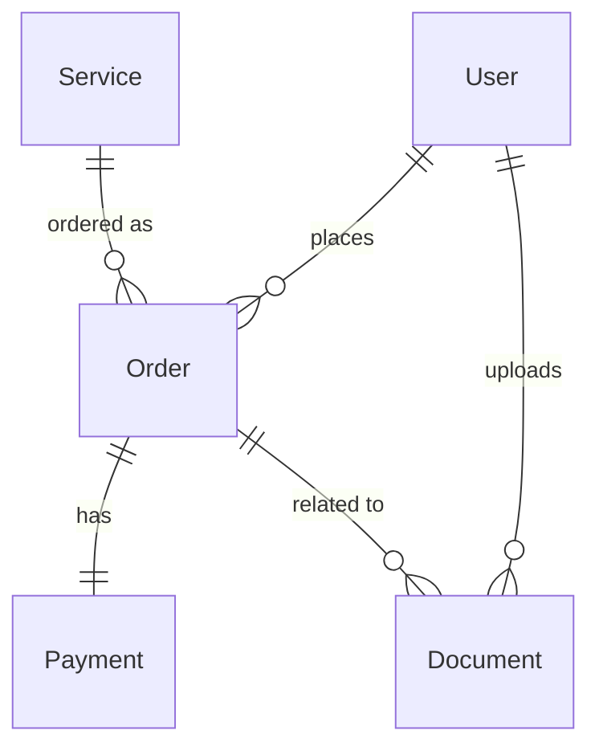

# Database Schema Documentation - Holyone Travels

**Project:** Holyone Travels (Travel & Visa Services Platform)  
**Database:** PostgreSQL  
**ORM:** Prisma  
**Created:** January 7, 2026  
**Version:** 1.0

---

## 📋 Overview

This document provides a comprehensive overview of the database schema for the Holyone Travels platform. The schema is designed to support a travel and visa services platform with order management, payment processing, document handling, and user management.

---

## 🗂️ Entity Relationship Diagram



---

## 📊 Complete Prisma Schema

```prisma
// ============================================
// PRISMA SCHEMA - HOLYONE TRAVELS
// ============================================

generator client {
  provider = "prisma-client-js"
}

datasource db {
  provider = "postgresql"
  url      = env("DATABASE_URL")
}

// ============================================
// USER MANAGEMENT
// ============================================

model User {
  id            String    @id @default(uuid())
  email         String    @unique
  password      String    // Hashed with bcrypt
  fullName      String
  phone         String?
  country       String?
  role          UserRole  @default(CUSTOMER)
  emailVerified Boolean   @default(false)
  isActive      Boolean   @default(true)
  createdAt     DateTime  @default(now())
  updatedAt     DateTime  @updatedAt
  lastLoginAt   DateTime?

  // Relations
  orders        Order[]
  documents     Document[]

  @@index([email])
  @@index([role])
  @@index([createdAt])
  @@map("users")
}

enum UserRole {
  CUSTOMER
  ADMIN
}


// ============================================
// SERVICES
// ============================================

model Service {
  id              String          @id @default(uuid())
  type            ServiceType
  title           String
  slug            String          @unique
  description     String
  longDescription String?
  price           Decimal         @db.Decimal(10, 2)
  oldPrice        Decimal?        @db.Decimal(10, 2)
  priceRange      String?
  images          String[]
  specs           Json?
  features        String[]
  region          String?
  category        String?
  isActive        Boolean         @default(true)
  isFeatured      Boolean         @default(false)
  sortOrder       Int             @default(0)
  createdAt       DateTime        @default(now())
  updatedAt       DateTime        @updatedAt

  // Relations
  orders          Order[]

  @@index([type])
  @@index([slug])
  @@index([isActive])
  @@index([isFeatured])
  @@map("services")
}

enum ServiceType {
  MAIN      // Main packages (Starter, Professional, Premium)
  MICRO     // Micro services (individual services)
  DIGITAL   // Digital products (downloadable guides)
}

// ============================================
// ORDERS
// ============================================

model Order {
  id              String       @id @default(uuid())
  orderNumber     String       @unique
  userId          String
  serviceId       String
  status          OrderStatus  @default(PENDING)
  totalAmount     Decimal      @db.Decimal(10, 2)
  currency        String       @default("USD")

  // Customer Information (JSON for flexibility)
  customerInfo    Json         // { fullName, email, phone, country }

  // Service-Specific Details (JSON for different service types)
  serviceDetails  Json?        // { destination, travelDate, passportNumber, etc. }

  // Service Snapshot (store service data at time of purchase)
  serviceSnapshot Json         // Complete service object

  // Metadata
  notes           String?
  adminNotes      String?

  createdAt       DateTime     @default(now())
  updatedAt       DateTime     @updatedAt
  completedAt     DateTime?
  cancelledAt     DateTime?

  // Relations
  user            User         @relation(fields: [userId], references: [id])
  service         Service      @relation(fields: [serviceId], references: [id])
  payment         Payment?
  documents       Document[]

  @@index([userId])
  @@index([serviceId])
  @@index([status])
  @@index([orderNumber])
  @@index([createdAt])
  @@map("orders")
}

enum OrderStatus {
  PENDING           // Order created, payment pending
  CONFIRMED         // Payment confirmed
  IN_PROGRESS       // Service being delivered
  AWAITING_DOCS     // Waiting for customer documents
  UNDER_REVIEW      // Documents under review
  COMPLETED         // Service completed
  CANCELLED         // Order cancelled
  REFUNDED          // Order refunded
}

// ============================================
// PAYMENTS
// ============================================

model Payment {
  id                     String        @id @default(uuid())
  orderId                String        @unique
  amount                 Decimal       @db.Decimal(10, 2)
  currency               String        @default("USD")
  status                 PaymentStatus @default(PENDING)
  paymentMethod          String        // "card", "paypal", "bank_transfer"

  // Stripe Integration
  stripePaymentIntentId  String?       @unique
  stripeChargeId         String?       @unique
  stripeCustomerId       String?

  // Payment Details
  cardLast4              String?
  cardBrand              String?
  cardCountry            String?

  // Metadata
  failureReason          String?
  failureCode            String?

  // Refunds
  refundAmount           Decimal?      @db.Decimal(10, 2)
  refundReason           String?
  refundedAt             DateTime?
  refundedBy             String?       // Admin user ID

  createdAt              DateTime      @default(now())
  updatedAt              DateTime      @updatedAt
  paidAt                 DateTime?

  // Relations
  order                  Order         @relation(fields: [orderId], references: [id], onDelete: Cascade)

  @@index([orderId])
  @@index([status])
  @@index([stripePaymentIntentId])
  @@index([createdAt])
  @@map("payments")
}

enum PaymentStatus {
  PENDING       // Payment initiated
  PROCESSING    // Payment being processed
  SUCCEEDED     // Payment successful
  FAILED        // Payment failed
  REFUNDED      // Payment refunded
  PARTIALLY_REFUNDED // Partial refund issued
  CANCELLED     // Payment cancelled
}

// ============================================
// DOCUMENTS
// ============================================

model Document {
  id              String         @id @default(uuid())
  userId          String
  orderId         String?

  // File Information
  fileName        String
  originalName    String
  fileUrl         String
  fileSize        Int            // Size in bytes
  mimeType        String

  // Categorization
  category        DocumentCategory
  description     String?

  // Verification
  status          DocumentStatus @default(PENDING)
  verifiedBy      String?        // Admin/Consultant user ID
  verifiedAt      DateTime?
  rejectionReason String?

  createdAt       DateTime       @default(now())
  updatedAt       DateTime       @updatedAt

  // Relations
  user            User           @relation(fields: [userId], references: [id], onDelete: Cascade)
  order           Order?         @relation(fields: [orderId], references: [id], onDelete: SetNull)

  @@index([userId])
  @@index([orderId])
  @@index([status])
  @@index([category])
  @@index([createdAt])
  @@map("documents")
}

enum DocumentCategory {
  PASSPORT
  PHOTO
  BANK_STATEMENT
  PROOF_OF_FUNDS
  TRAVEL_ITINERARY
  ACCOMMODATION_PROOF
  EMPLOYMENT_LETTER
  EDUCATION_CERTIFICATE
  VISA_COPY
  FLIGHT_TICKET
  INSURANCE
  INVITATION_LETTER
  OTHER
}

enum DocumentStatus {
  PENDING       // Awaiting review
  VERIFIED      // Approved by admin/consultant
  REJECTED      // Rejected, needs replacement
  ARCHIVED      // Old version, replaced
}

```

---

## 📖 Table Descriptions

### Users Table (`users`)

**Purpose:** Store user account information for customers and admins.

**Key Fields:**

- `id`: Unique user identifier (UUID)
- `email`: User's email (unique, used for login)
- `password`: Bcrypt hashed password
- `role`: User role (CUSTOMER, ADMIN)
- `emailVerified`: Whether email is verified

**Relationships:**

- Has many Orders
- Has many Documents

---

### Services Table (`services`)

**Purpose:** Catalog of all services offered (main packages, micro services, digital products).

**Key Fields:**

- `type`: Service category (MAIN, MICRO, DIGITAL)
- `price`: Current price
- `oldPrice`: Previous price for discount display
- `specs`: JSON field for flexible service specifications
- `isActive`: Whether service is available for purchase

**Relationships:**

- Has many Orders

---

### Orders Table (`orders`)

**Purpose:** Track all customer orders and their lifecycle.

**Key Fields:**

- `orderNumber`: Human-readable order reference (e.g., HT-2026-001234)
- `status`: Current order status
- `customerInfo`: JSON storing customer details
- `serviceDetails`: JSON storing service-specific information
- `serviceSnapshot`: Complete service data at time of purchase
- `notes`: Customer notes
- `adminNotes`: Internal admin notes

**Relationships:**

- Belongs to User
- Belongs to Service
- Has one Payment
- Has many Documents

---

### Payments Table (`payments`)

**Purpose:** Track payment transactions and integration with Stripe.

**Key Fields:**

- `stripePaymentIntentId`: Stripe's payment intent ID
- `status`: Payment status (PENDING, SUCCEEDED, FAILED, etc.)
- `paymentMethod`: Method used (card, paypal, etc.)
- `refundAmount`: Amount refunded (if applicable)

**Relationships:**

- Belongs to Order (one-to-one)

---

### Documents Table (`documents`)

**Purpose:** Store uploaded documents for visa applications.

**Key Fields:**

- `fileUrl`: Cloudinary URL
- `category`: Document type (PASSPORT, BANK_STATEMENT, etc.)
- `status`: Verification status (PENDING, VERIFIED, REJECTED)
- `rejectionReason`: Reason for rejection (if applicable)

**Relationships:**

- Belongs to User
- Belongs to Order (optional)

---

## 🔗 Key Relationships

### One-to-One Relationships

- Order ↔ Payment

### One-to-Many Relationships

- User → Orders
- User → Documents
- Service → Orders
- Order → Documents

### Many-to-Many Relationships

None currently (future: tags for services, or service bundles)

---

## 📇 Indexes

### Performance Optimization

**Users Table:**

```sql
CREATE INDEX idx_users_email ON users(email);
CREATE INDEX idx_users_role ON users(role);
CREATE INDEX idx_users_created_at ON users(created_at);
```

**Orders Table:**

```sql
CREATE INDEX idx_orders_user_id ON orders(user_id);
CREATE INDEX idx_orders_service_id ON orders(service_id);
CREATE INDEX idx_orders_status ON orders(status);
CREATE INDEX idx_orders_order_number ON orders(order_number);
CREATE INDEX idx_orders_created_at ON orders(created_at);
```

**Payments Table:**

```sql
CREATE INDEX idx_payments_order_id ON payments(order_id);
CREATE INDEX idx_payments_status ON payments(status);
CREATE INDEX idx_payments_stripe_payment_intent_id ON payments(stripe_payment_intent_id);
CREATE INDEX idx_payments_created_at ON payments(created_at);
```

**Documents Table:**

```sql
CREATE INDEX idx_documents_user_id ON documents(user_id);
CREATE INDEX idx_documents_order_id ON documents(order_id);
CREATE INDEX idx_documents_status ON documents(status);
CREATE INDEX idx_documents_category ON documents(category);
```

---

## 🔐 Data Constraints

### Unique Constraints

- `users.email` - Email must be unique
- `orders.orderNumber` - Order number must be unique
- `services.slug` - Service slug must be unique
- `payments.orderId` - One payment per order
- `payments.stripePaymentIntentId` - Unique Stripe ID

### Foreign Key Constraints

All foreign keys have `ON DELETE CASCADE` or `ON DELETE SET NULL` based on business logic:

- Documents: `ON DELETE CASCADE` (delete docs when user is deleted)
- Orders: Keep orders when service is deleted (archive)
- Payments: `ON DELETE CASCADE` with order

### Check Constraints

None required for current schema.

---

## 📊 JSON Field Structures

### Order.customerInfo

```json
{
  "fullName": "John Doe",
  "email": "john@example.com",
  "phone": "+1234567890",
  "country": "United States"
}
```

### Order.serviceDetails

```json
{
  "destination": "Canada",
  "travelDate": "2026-06-15",
  "passportNumber": "X12345678",
  "nationality": "Nigerian",
  "purposeOfTravel": "Study",
  "additionalNotes": "Planning to study Computer Science"
}
```

### Order.serviceSnapshot

```json
{
  "id": "pkg-pro",
  "title": "Professional Visa Support",
  "price": 300,
  "type": "MAIN",
  "features": ["SOP review", "CV formatting", "Application guidance"]
}
```

### Service.specs

```json
{
  "processingTime": "2-8 Weeks",
  "consultation": "Priority WhatsApp",
  "category": "Full Support",
  "language": "English"
}
```

---

## 🔄 Data Migration Strategy

### Initial Setup

```bash
# Initialize Prisma
npx prisma init

# Create migration
npx prisma migrate dev --name init

# Generate Prisma Client
npx prisma generate

# Seed database
npx prisma db seed
```

### Seed Data Script

```typescript
// prisma/seed.ts
import { PrismaClient } from "@prisma/client";
import * as bcrypt from "bcrypt";

const prisma = new PrismaClient();

async function main() {
  // Create admin user
  const admin = await prisma.user.create({
    data: {
      email: "admin@holyonetravels.com",
      password: await bcrypt.hash("admin123", 10),
      fullName: "Admin User",
      role: "ADMIN",
      emailVerified: true,
    },
  });

  // Create services (import from existing data)
  // ... seed services

  console.log("Database seeded successfully");
}

main()
  .catch((e) => console.error(e))
  .finally(async () => await prisma.$disconnect());
```

---

## 🔍 Common Queries

### Get User Orders with Payment Status

```typescript
const userOrders = await prisma.order.findMany({
  where: { userId: userId },
  include: {
    service: true,
    payment: true,
    documents: true,
  },
  orderBy: { createdAt: "desc" },
});
```

### Get Orders Requiring Document Review

```typescript
const pendingDocs = await prisma.document.findMany({
  where: { status: "PENDING" },
  include: {
    order: true,
    user: true,
  },
});
```

### Get Admin Dashboard - Active Orders

```typescript
const activeOrders = await prisma.order.findMany({
  where: {
    status: {
      in: ["CONFIRMED", "IN_PROGRESS", "AWAITING_DOCS", "UNDER_REVIEW"],
    },
  },
  include: {
    user: true,
    service: true,
    payment: true,
    documents: true,
  },
  orderBy: { createdAt: "desc" },
});
```

---

## 🛡️ Security Considerations

### Sensitive Data

- **Passwords:** Always hashed with bcrypt (salt rounds: 10)
- **Payment Info:** Never store full card numbers (only last 4 digits)
- **Documents:** Stored in secure Cloudinary storage with signed URLs

### Access Control

- Row-level security via Prisma middleware
- Admin-only access to order management
- Customers can only access their own data
- Document verification requires admin role

### Data Retention

- Orders: Keep forever (archive)
- Documents: Keep for 7 years (compliance)
- Payments: Keep forever for accounting

---

## 📈 Scaling Considerations

### Database Partitioning

Consider partitioning large tables:

- `orders` - Partition by created_at (yearly)
- `payments` - Partition by created_at (yearly)
- `documents` - Partition by created_at (yearly)

### Read Replicas

- Use read replicas for reporting queries
- Direct dashboard queries to replicas

### Caching Strategy

- Cache service catalog (Redis, 1-hour TTL)
- Cache user sessions (Redis)
- Cache frequently accessed order data

---

## 🔧 Maintenance Tasks

### Regular Cleanup

```sql
-- Archive old documents (archived status, older than 1 year)
DELETE FROM documents
WHERE status = 'ARCHIVED'
AND created_at < NOW() - INTERVAL '1 year';
```

### Database Backups

- **Daily:** Automated backups
- **Retention:** 30 days
- **Point-in-time recovery:** Enabled

---

## ✅ Schema Validation Checklist

- [x] All tables have primary keys
- [x] Foreign keys properly defined
- [x] Indexes on frequently queried fields
- [x] Enums for fixed value sets
- [x] Timestamps on all tables
- [x] Soft delete capability where needed
- [x] JSON fields for flexible data
- [x] Proper data types for amounts (Decimal)
- [x] UUID for primary keys
- [x] Cascading deletes configured

---

## 🎯 Future Enhancements

### Planned Schema Changes

**Phase 2:**

- Add `ServiceBundle` table for package combinations
- Add `Coupon` and `Discount` tables
- Add `LoyaltyPoints` table

**Phase 3:**

- Add `ChatMessage` table for customer support
- Add `KnowledgeBase` table for FAQ/Help center
- Add multi-currency support tables

---

## 📞 Support

For schema-related questions:

- Database Admin: dba@holyonetravels.com
- Backend Lead: backend@holyonetravels.com

---

**Document Version:** 1.0  
**Last Updated:** January 7, 2026  
**Author:** Antigravity AI Assistant  
**Status:** Production Ready
