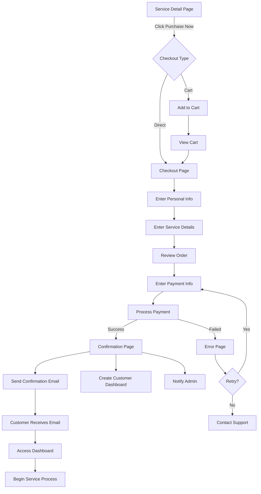

# Service Purchase User Flow

## Overview
This document outlines the complete user journey from viewing a service detail page to completing a purchase for Holyone Pathway Partners visa and immigration services.

---

## User Flow Steps

### Step 1: Service Detail Page
**Page:** `/services/[id]`

**User Actions:**
- User browses service details (description, features, pricing)
- Reviews service specifications (category, language, etc.)
- Views image carousel (if available)
- Sees pricing in the sidebar with any discounts

**CTA Options:**
1. **"Purchase Now!"** button (primary action)
2. **"Book Consultation"** button (secondary - for custom needs)

---

### Step 2: Add to Cart / Checkout Initiation
**Trigger:** User clicks "Purchase Now!" button

**Options:**

#### Option A: Direct Checkout (Recommended for Services)
- Redirect directly to checkout page
- Pre-populate service details

#### Option B: Cart System
- Add service to cart
- Show cart notification/modal
- Allow user to continue shopping or proceed to checkout

**Recommended:** Option A (Direct Checkout) for simplicity with service purchases

---

### Step 3: Checkout Page
**Page:** `/checkout`

**Information Collection:**

#### Personal Information
- Full Name
- Email Address
- Phone Number
- Country of Residence

#### Service-Specific Information
- Destination Country (for visa services)
- Visa Type/Category
- Intended Travel Date (if applicable)
- Additional Notes/Requirements

#### Order Summary
- Service name and description
- Price breakdown
- Any applicable taxes
- Total amount

**Actions:**
- Review order details
- Proceed to payment

---

### Step 4: Payment Information
**Integration Options:**

#### Recommended Payment Providers:
1. **Stripe** (International, supports multiple currencies)
2. **PayPal** (Widely trusted)
3. **Paystack** (Good for African markets)

**Payment Details to Collect:**
- Card Number
- Expiration Date
- CVV
- Billing Address
- Cardholder Name

**Security Features:**
- SSL encryption indicator
- Secure payment badge
- PCI compliance notice

---

### Step 5: Payment Processing
**Loading State:**
- Show processing indicator
- Display "Please wait, processing your payment..."
- Prevent duplicate submissions

**Backend Actions:**
- Validate payment information
- Process payment through payment gateway
- Create order record in database
- Generate order confirmation number

---

### Step 6: Payment Confirmation
**Success Scenario:**

#### Confirmation Page
**Page:** `/checkout/success` or `/order-confirmation/[orderId]`

**Display:**
- ✅ Success message: "Payment Successful!"
- Order confirmation number
- Service details purchased
- Amount paid
- Payment method used
- Estimated timeline for service delivery

**Actions:**
- Send confirmation email to customer
- Send notification to admin/team
- Create customer account (if new user)

**Next Steps for User:**
- Download receipt/invoice
- View order details
- Access customer dashboard
- Contact support if needed

---

#### Failure Scenario
**Page:** `/checkout/failed`

**Display:**
- ❌ Error message explaining what went wrong
- Reason for failure (card declined, insufficient funds, etc.)
- Order details (for reference)

**Actions:**
- Option to retry payment
- Option to use different payment method
- Contact support link
- Return to service page

---

### Step 7: Post-Purchase Experience

#### Immediate Actions
1. **Email Confirmation**
   - Order summary
   - Receipt/Invoice (PDF)
   - Next steps
   - Contact information

2. **Customer Dashboard Access**
   - Login credentials (if new user)
   - Order history
   - Service status tracking
   - Document upload area (for visa documents)

#### Follow-up Communication
1. **Welcome Email** (within 1 hour)
   - Introduction to the service
   - What to expect next
   - Required documents checklist
   - Assigned consultant information (for premium packages)

2. **Onboarding Email** (within 24 hours)
   - Detailed service roadmap
   - Timeline expectations
   - How to get started
   - Scheduling first consultation (if applicable)

---

## Visual Flow Diagram

---

## Key Pages to Implement

### 1. `/checkout`
- Personal information form
- Service-specific questions
- Order summary
- Payment integration

### 2. `/checkout/success`
- Success confirmation
- Order details
- Next steps
- Download receipt

### 3. `/checkout/failed`
- Error message
- Retry options
- Support contact

### 4. `/dashboard` (Customer Portal)
- Order history
- Active services
- Document uploads
- Messages/Communication
- Profile settings

---

## Technical Considerations

### Database Schema Needs

#### Orders Table
- order_id
- user_id
- service_id
- order_date
- status (pending, completed, failed, refunded)
- total_amount
- payment_method
- payment_status
- confirmation_number

#### Payments Table
- payment_id
- order_id
- amount
- currency
- payment_gateway (stripe, paypal, etc.)
- transaction_id
- payment_date
- status

#### User Service Assignments Table
- assignment_id
- user_id
- service_id
- order_id
- consultant_id (for premium packages)
- start_date
- status (active, completed, cancelled)

---

## Security & Compliance

### Required Security Measures
- ✅ SSL/TLS encryption
- ✅ PCI DSS compliance (for payment processing)
- ✅ Secure session management
- ✅ Input validation and sanitization
- ✅ GDPR compliance (for EU customers)
- ✅ Data encryption at rest

### Privacy Considerations
- Clear privacy policy
- Terms of service acceptance
- Data retention policy
- Right to data deletion
- Cookie consent (if applicable)

---

## User Experience Best Practices

### Checkout Optimization
1. **Progress Indicator** - Show steps (1 of 3, 2 of 3, etc.)
2. **Auto-save** - Save form data to prevent loss
3. **Mobile Responsive** - Ensure smooth mobile checkout
4. **Guest Checkout** - Allow purchase without account creation
5. **Multiple Payment Options** - Offer card, PayPal, etc.
6. **Clear Error Messages** - Help users fix issues quickly
7. **Trust Signals** - Display security badges, testimonials

### Conversion Optimization
- Minimize form fields
- Use smart defaults
- Provide inline validation
- Show estimated delivery time
- Offer live chat support during checkout
- Display money-back guarantee
- Show customer reviews/testimonials

---

## Email Templates Needed

### 1. Order Confirmation Email
- Subject: "Order Confirmation - [Service Name]"
- Order details and receipt
- Next steps
- Contact information

### 2. Welcome Email
- Subject: "Welcome to Holyone Pathway Partners!"
- Introduction to service
- What to expect
- Getting started guide

### 3. Payment Failed Email
- Subject: "Payment Issue - Action Required"
- Explanation of issue
- Retry payment link
- Support contact

### 4. Service Onboarding Email
- Subject: "Let's Get Started with Your [Service Name]"
- Detailed roadmap
- Document checklist
- Consultation scheduling link

---

## Success Metrics to Track

### Conversion Metrics
- Service detail page → Checkout rate
- Checkout initiation → Completion rate
- Payment success rate
- Average order value
- Cart abandonment rate

### User Experience Metrics
- Time to complete checkout
- Form field completion rates
- Error rates by field
- Payment method preferences
- Mobile vs desktop conversion rates

### Business Metrics
- Revenue by service type
- Customer lifetime value
- Repeat purchase rate
- Refund/chargeback rate
- Customer acquisition cost
