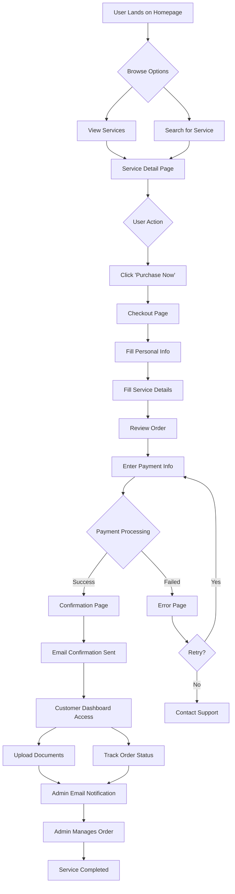

# Holyone Travels - User Flow Documentation (Simplified)

**Platform:** Holyone Travels (Travel & Visa Services)  
**Document Type:** User Flow & Journey Mapping  
**Database Schema:** 5 Core Models (User, Service, Order, Payment, Document)  
**Updated:** January 7, 2026  
**Status:** Aligned with Simplified Schema

---

## 📋 Overview

This document outlines the complete user journey through the Holyone Travels platform. The flow is designed around a **simplified architecture** with 5 core database models, using **email notifications** for admin communication instead of complex database tracking.

### Service Types

1. **Main Packages** - Comprehensive visa guidance (Starter, Professional, Premium)
2. **Micro Services** - À la carte services (eligibility checks, SOP writing, etc.)
3. **Digital Products** - Downloadable guides for various countries

---

## 🎯 User Personas

### Primary Persona: International Student/Worker

- **Goal:** Obtain visa for study/work abroad
- **Pain Points:** Complex application process, document requirements unclear
- **Tech Savviness:** Moderate to high
- **Budget:** $100 - $4,000

### Secondary Persona: Travel Enthusiast

- **Goal:** Plan international travel with visa support
- **Pain Points:** Visa requirements by country, tight timelines
- **Tech Savviness:** High
- **Budget:** $15 - $100 (digital products)

---

## 🗺️ Complete User Journey Map



---

## 📍 Detailed User Flow Steps

### **Phase 1: Discovery & Exploration**

#### Step 1.1: Homepage Landing

**Database:** `services` table (read-only)

**User Arrives From:**

- Google search (organic/paid)
- Social media
- Referral link
- Direct URL

**Homepage Elements:**

- Hero section with value proposition
- Search bar for services
- Featured packages (from `services` where `isFeatured = true`)
- Testimonials (static or external reviews)
- FAQ section
- "Get Started" CTA

---

#### Step 1.2: Service Browsing

**Database:** `services` table

**Query:**

```sql
SELECT * FROM services
WHERE is_active = true
ORDER BY sort_order, type
```

**Available Service Categories:**

1. **Main Packages** - `type = 'MAIN'`
2. **Micro Services** - `type = 'MICRO'`
3. **Digital Products** - `type = 'DIGITAL'`

**User Actions:**

- Compare packages side-by-side
- Filter by type
- Filter by price range
- Click "View Details"

---

### **Phase 2: Service Evaluation**

#### Step 2.1: Service Detail Page

**Database:** `services` table

**Query:**

```sql
SELECT * FROM services
WHERE id = :serviceId AND is_active = true
```

**Page Sections:**

1. Service title and description
2. Pricing (with discounts if `oldPrice` exists)
3. Image gallery (`images` array)
4. Service specifications (`specs` JSON)
5. Features list (`features` array)
6. **"Purchase Now!"** button (primary CTA)
7. Trust indicators (secure checkout, 256-bit encryption)

**User Actions:**

- Read full description
- View pricing
- Check features
- Click "Purchase Now"

---

### **Phase 3: Checkout Process**

#### Step 3.1: Checkout Page Initiation

**Database:** Create `order` record

**Page:** `/checkout?serviceId=xxx`

**Order Created:**

```sql
INSERT INTO orders (
  order_number, user_id, service_id, status,
  total_amount, customer_info, service_snapshot
) VALUES (
  'HT-2026-000001', :userId, :serviceId, 'PENDING',
  :amount, :customerInfoJSON, :serviceSnapshotJSON
)
```

**Order Summary Displays:**

- Service name and type (from `service_snapshot` JSON)
- Price
- Total amount
- Estimated processing time

---

#### Step 3.2: Personal Information (Step 1)

**Database:** `users` table (if new user) + `orders.customerInfo` JSON

**Required Fields:**

- Full name
- Email address (with validation)
- Phone number (with country code)
- Country of residence

**For New Users:**

```sql
INSERT INTO users (email, password, full_name, role)
VALUES (:email, :hashedPassword, :fullName, 'CUSTOMER')
```

**Stored in Order:**

```json
{
  "fullName": "John Doe",
  "email": "john@example.com",
  "phone": "+1234567890",
  "country": "United States"
}
```

---

#### Step 3.3: Service-Specific Details (Step 2)

**Database:** `orders.serviceDetails` JSON

**For Main Packages & Micro Services:**

- Destination country
- Visa type/category
- Intended travel date
- Passport number
- Nationality
- Purpose of travel
- Additional notes

**Stored in Order:**

```json
{
  "destination": "Canada",
  "travelDate": "2026-06-15",
  "passportNumber": "X12345678",
  "nationality": "Nigerian",
  "purposeOfTravel": "Study",
  "additionalNotes": "Planning to study Computer Science"
}
```

---

#### Step 3.4: Order Review (Step 3)

**Database:** Read from `orders`, `services`

**Review Sections:**

**1. Personal Information**

- From `orders.customerInfo` JSON
- Edit button (returns to step 1)

**2. Service Details**

- From `orders.serviceDetails` JSON
- Edit button (returns to step 2)

**3. Price Breakdown**

```
Service:        $300.00
Tax (if any):    $30.00
──────────────────────
Total:          $330.00
```

**4. Terms & Conditions**

- ☐ I agree to the Terms of Service
- ☐ I agree to the Cancellation Policy

---

### **Phase 4: Payment Processing**

#### Step 4.1: Payment Method Selection

**Database:** Create `payment` record

**Create Payment Intent:**

```sql
INSERT INTO payments (
  order_id, amount, currency, status, payment_method,
  stripe_payment_intent_id
) VALUES (
  :orderId, :amount, 'USD', 'PENDING', 'card',
  :stripePaymentIntentId
)
```

**Payment Options:**

- Credit/Debit Card (Stripe)
- PayPal (if enabled)
- Apple Pay / Google Pay

**Security Indicators:**

- 🔒 SSL encryption badge
- Stripe logo (trusted payment processor)
- "Your payment is secure" message

---

#### Step 4.2: Payment Processing

**Database:** Update `payments` and `orders` tables

**On Success:**

```sql
-- Update payment
UPDATE payments
SET status = 'SUCCEEDED', paid_at = NOW(),
    card_last4 = :last4, card_brand = :brand
WHERE order_id = :orderId;

-- Update order
UPDATE orders
SET status = 'CONFIRMED', updated_at = NOW()
WHERE id = :orderId;
```

**Email Sent:** Order confirmation via Resend (not stored in database)

---

#### Step 4.3: Payment Result

**Success Path:** Redirect to `/checkout/success?orderId=xxx`

**Failure Path:** Redirect to `/checkout/failed`

---

### **Phase 5: Post-Payment Experience**

#### Step 5.1: Success Page

**Database:** Read `orders`, `payments`, `services`

**Query:**

```sql
SELECT o.*, p.*, s.title as service_name
FROM orders o
JOIN payments p ON o.id = p.order_id
JOIN services s ON o.service_id = s.id
WHERE o.id = :orderId AND o.user_id = :userId
```

**Success Elements:**

**1. Confirmation Header**

- ✅ "Payment Successful!" heading
- Order number (e.g., `HT-2026-000001`)
- Amount paid

**2. Order Details**

- Service purchased
- Payment method used
- Date

**3. Next Steps**

- ✉️ Check email for confirmation
- 📄 Download invoice (PDF)
- 📂 Upload required documents
- 💬 Contact support if needed

**4. Quick Actions**

```
[Download Invoice]  [View Dashboard]  [Upload Documents]
```

---

#### Step 5.2: Failure/Error Page

**Error Elements:**

- ❌ "Payment Failed" heading
- Specific error reason (from `payments.failureReason`)
- Order reference

**Action Options:**

```
[Try Again]  [Use Different Card]  [Contact Support]
```

---

### **Phase 6: Customer Dashboard**

#### Step 6.1: Dashboard Overview

**Database:** `orders`, `payments`, `documents`

**Query:**

```sql
-- Active orders count
SELECT COUNT(*) FROM orders
WHERE user_id = :userId
AND status IN ('CONFIRMED', 'IN_PROGRESS', 'AWAITING_DOCS')

-- Pending documents count
SELECT COUNT(*) FROM documents
WHERE user_id = :userId AND status = 'PENDING'
```

**Dashboard Displays:**

```
Welcome back, John!
You have 2 active orders and 3 pending documents.
```

---

#### Step 6.2: Order List

**Database:** `orders` with relations

**Query:**

```sql
SELECT o.*, s.title, p.status as payment_status
FROM orders o
JOIN services s ON o.service_id = s.id
LEFT JOIN payments p ON o.id = p.order_id
WHERE o.user_id = :userId
ORDER BY o.created_at DESC
```

**Each Order Card Shows:**

- Order number
- Service name
- Status badge
- Total amount
- Created date
- "View Details" button

---

#### Step 6.3: Order Details Page

**Database:** `orders`, `payments`, `services`, `documents`

**Query:**

```sql
SELECT o.*, p.*, s.*,
  (SELECT COUNT(*) FROM documents WHERE order_id = o.id) as doc_count
FROM orders o
JOIN services s ON o.service_id = s.id
JOIN payments p ON o.id = p.order_id
WHERE o.id = :orderId AND o.user_id = :userId
```

**Order Information:**

**1. Order Status Timeline**

```
✅ Order Placed - Jan 7, 2026, 9:30 AM
✅ Payment Confirmed - Jan 7, 2026, 9:31 AM
🔵 Awaiting Documents - Current
⏳ Under Review - Pending
⏳ In Progress - Pending
⏳ Completed - Pending
```

**2. Service Details**

- All information from `customerInfo` and `serviceDetails` JSON

**3. Documents Section**

- Required documents checklist
- Uploaded documents with status
- Upload button

**4. Notes**

- Customer notes (from `orders.notes`)
- Admin notes (from `orders.adminNotes`, if admin role)

---

#### Step 6.4: Document Upload

**Database:** `documents` table

**Upload Process:**

```sql
INSERT INTO documents (
  user_id, order_id, file_name, original_name, file_url,
  file_size, mime_type, category, status
) VALUES (
  :userId, :orderId, :cloudinaryPublicId, :originalName, :cloudinaryUrl,
  :fileSize, :mimeType, :category, 'PENDING'
)
```

**After Upload:**

- Email sent to admin via Resend (not in database)
- Admin receives notification to verify document

**Uploaded Documents Table:**

```
Document Name          Category        Status       Actions
──────────────────────────────────────────────────────────
passport.pdf          PASSPORT        ✅ Verified   [View] [Delete]
photo.jpg             PHOTO           ⏳ Pending    [View] [Delete]
bank_statement.pdf    BANK_STATEMENT  ❌ Rejected   [View] [Replace]
```

**Document Status:**

- ✅ **Verified** - Approved by admin
- ⏳ **Pending** - Awaiting admin review
- ❌ **Rejected** - Needs replacement (reason shown)

---

#### Step 6.5: Profile Management

**Database:** `users` table

**Update Profile:**

```sql
UPDATE users
SET full_name = :fullName, phone = :phone, country = :country
WHERE id = :userId
```

**Profile Sections:**

- Personal information (editable)
- Email (view only, change via verification)
- Password change
- Account deletion

---

### **Phase 7: Email Communication (Resend)**

All emails are sent via Resend and **NOT stored in database**.

#### Email 1: Order Confirmation (Immediate)

**Triggered:** After payment success

**Content:**

- Order number and details
- Amount paid
- What happens next
- Upload documents link
- Contact support info

---

#### Email 2: Document Upload Confirmation

**Triggered:** After document upload

**To Customer:**

- Document received confirmation
- Review timeline (24-48 hours)

**To Admin:**

- New document uploaded
- Order number
- Customer name
- Direct link to admin panel

---

#### Email 3: Document Verification Result

**Triggered:** Admin verifies/rejects document

**To Customer:**

- Document status (approved/rejected)
- If rejected: reason and instructions
- Next steps

---

#### Email 4: Order Status Updates

**Triggered:** When order status changes

**To Customer:**

- Status change notification
- What this means
- Expected timeline
- Next actions required

**To Admin:**

- Internal notification
- Order tracking

---

#### Email 5: Service Completion

**Triggered:** Order status = COMPLETED

**To Customer:**

- Congratulations message
- Service summary
- Feedback request (external link, not in database)
- Support contact if needed

---

## 📱 Mobile User Flow Considerations

### Mobile-Specific Features

1. **Tap-to-Call** for support
2. **Mobile Payment** (Apple Pay, Google Pay)
3. **Camera Access** for document upload
4. **SMS Notifications** (via Resend)
5. **Bottom Sheet** navigation

---

## 🔄 Alternative User Flows

### Guest Checkout

**Path:** Service → Checkout → Payment → Account Auto-Created

**Process:**

1. User checks out without account
2. Account created after payment (`users` table)
3. Credentials sent via email
4. User can login to dashboard

---

### Digital Product Path (Simplified)

**Path:** Browse → Select → Checkout (2 steps) → Payment → Instant Download

**Simplified Checkout:**

- Personal info only (no service details needed)
- Immediate delivery via email
- Optional dashboard access

---

## 🎨 UX Best Practices

### Conversion Optimization

- ✅ Clear value proposition
- ✅ Trust signals (testimonials, secure checkout)
- ✅ Progress indicators
- ✅ Guest checkout option
- ✅ Multiple payment methods
- ✅ Mobile-responsive

### Accessibility

- ✅ Keyboard navigation
- ✅ Screen reader friendly
- ✅ High contrast mode
- ✅ Clear error messages

---

## 📊 Database Operations Summary

### Read Operations (Most Frequent)

```sql
-- Get services for listing
SELECT * FROM services WHERE is_active = true

-- Get service details
SELECT * FROM services WHERE id = :id

-- Get user orders
SELECT * FROM orders WHERE user_id = :userId

-- Get order with payment
SELECT o.*, p.* FROM orders o
JOIN payments p ON o.id = p.order_id
WHERE o.id = :orderId
```

### Write Operations

```sql
-- Create order
INSERT INTO orders (...) VALUES (...)

-- Create payment
INSERT INTO payments (...) VALUES (...)

-- Upload document
INSERT INTO documents (...) VALUES (...)

-- Update order status
UPDATE orders SET status = :status WHERE id = :orderId

-- Verify document
UPDATE documents SET status = 'VERIFIED', verified_by = :adminId
WHERE id = :documentId
```

---

## 📧 Email Workflows (Not in Database)

### Admin Email Notifications

All admin communications via email, not database:

- New order received
- Document uploaded
- Customer inquiry
- Order status change needed
- Refund requested

**Handled via:** Resend webhook → Admin email

---

## 🎯 Success Metrics

### User Flow Metrics

- Service page → Checkout: Target > 30%
- Checkout → Payment: Target > 70%
- Payment Success: Target > 95%
- Document Upload: Target > 80%

### Performance Metrics

- Page load time: < 3 seconds
- Checkout completion: < 5 minutes
- Payment processing: < 10 seconds

---

## ✅ Key Takeaways

### Database Simplification Benefits

1. **5 Core Models** - User, Service, Order, Payment, Document
2. **JSON Fields** - Flexible customerInfo and serviceDetails
3. **Email-Based Workflows** - No complex notification tables
4. **Faster Development** - Less schema complexity

### User Journey Highlights

1. **Discovery** → Browse services (read from `services`)
2. **Evaluation** → View details (read from `services`)
3. **Checkout** → Create order (write to `orders`)
4. **Payment** → Process payment (write to `payments`)
5. **Management** → Upload docs (write to `documents`)
6. **Communication** → All via email (Resend, not in DB)

---

**Document Version:** 2.0 (Simplified)  
**Last Updated:** January 7, 2026  
**Aligned With:** 5-Model Database Schema  
**Status:** Production Ready
